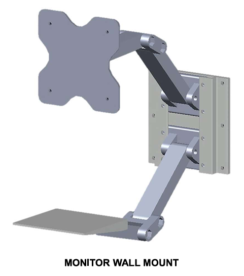
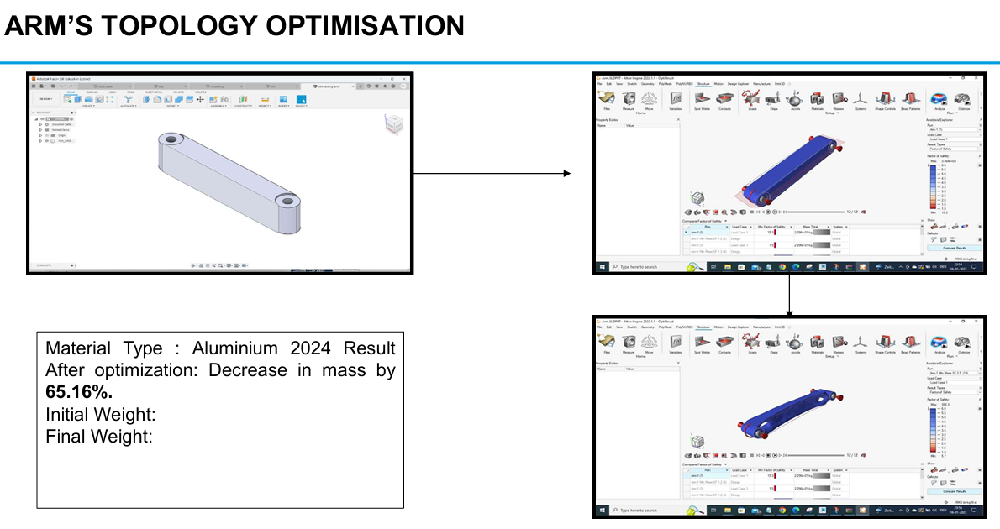
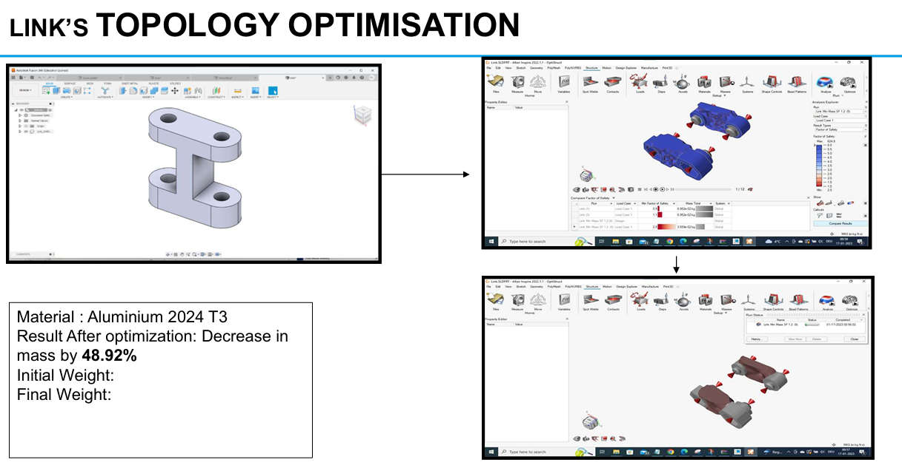

# Topology Optimization – Monitor Wall Mount (Altair Inspire)

## 📌 Overview
Lightweight redesign of a **monitor wall mount** using **FEM-based topology optimization** in **Altair Inspire**. Target: reduce mass while preserving structural integrity under defined load cases and constraints.

---

## ⭐ STAR Summary

**Situation** – Conventional wall mounts carry excess material without proportional strength gains.  
**Task** – Create a **lightweight design** that meets stiffness/strength requirements with minimum mass.  
**Action** – Modeled baseline geometry, defined load cases & boundary conditions, ran **topology optimization** in Altair Inspire, and validated the optimized form via **FEA**.  
**Result** – Significant **component-level mass reduction** while maintaining functionality, e.g.  
- **Arm:** −**65.16%** mass (Aluminium 2024)  
- **Link:** −**48.92%** mass (Aluminium 2024-T3)

---

## 📊 Figures

### 1) Assembly – Baseline
  
*Baseline assembly prior to optimization (reference geometry & constraints).*

### 2) ARM – Topology Optimized
  
*Optimized material layout in the **ARM**; mass reduced by **65.16%** while meeting stiffness targets.*

### 3) LINK – Topology Optimized
  
*Optimized **LINK** component; mass reduced by **48.92%** with required load-path continuity.*

> Notes  
> • Material per component: **Aluminium 2024 / 2024-T3** (see report for details).  
> • Full constraints, load magnitudes, and FEA checks documented below.

---

## 📂 Reports

- 📑 **Final Report (PDF):** [`TopologyOptimization_Report.pdf`](docs/reports/TopologyOptimization_Report.pdf)  
- 🖥️ **Final Presentation (PDF):** [`TopologyOptimization_Presentation.pdf`](docs/reports/TopologyOptimization_Presentation.pdf)

---

## 🧰 Method & Tooling
- **Altair Inspire** for topology optimization (objective: mass minimization; constraints: displacement/stress bounds).  
- **FEM validation** of the optimized geometry (post-processing stress/displacement).  
- CAD clean-up & manufacturability interpretation from iso-topology to solid model.

---

## 🗂️ (Optional) Models & Data
Large CAD files are attached to the release to keep the repo lightweight:
- `MonitorMount_STEP_IGES.zip` (STEP/IGES for key parts)

---

## 🔑 Key Takeaways
- Demonstrated **lightweight design** with **measurable mass reductions** at component level.  
- End-to-end **CAE workflow**: baseline → topology optimization → FEA validation → design interpretation.  
- Approach is transferable to **automotive/aerospace** lightweighting tasks.

---

## ⚖️ License
Distributed under the [MIT License](LICENSE).
